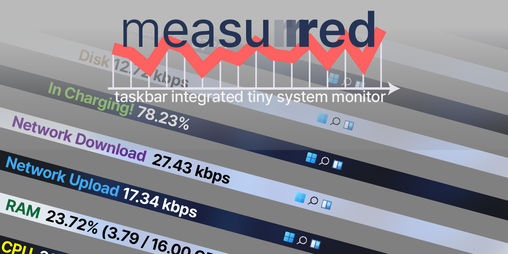

> ❗CAUTION: This is an early-stage product. You may end up with inconvenient experience, but please consider reporting your problem on the issue tab in this repository and contribute to the community for better product. We would appreciate your efforts.

## Features

- Monitor the System
  - [x] CPU Usage
  - [x] RAM Usage
  - [x] Network Up/Down
  - [x] Batteries Remaining
  - [ ] GPU Usage
  - [ ] Power Usage Trend
  - [ ] Core Temperature
  - [ ] Weather
  - [ ] Disk Usage
  - [ ] Fan Speed
- Show In-depth Panel on Click (todo)
- Fancy Settings UI (todo)

## Motivation

As of Windows 11, Microsoft decided to eliminate the old DeskBand API, so the programs like [BatteryBar](https://batterybarpro.com/) (they decided to use floating window in Windows 11), and [NetSpeedMonitor](https://netspeedmonitor.net/) (I think they aren't maintaining because the latest version was published in 2019) have faced their end of life in DeskBand. By the way, there are some programs that didn't rely on the DeskBand API, like [TrafficMonitor](https://github.com/zhongyang219/TrafficMonitor/blob/master/README_en-us.md). But I need something extensible and customizable easily enough like [RainMeter](https://www.rainmeter.net/). So I made this, measurrred, a tiny taskbar integrated system monitor. Keep watch this evolving. Thanks!

### Features I Want to Implement

- Alter clock
- Remove network integrated sound icon or replace that with EarTrumpet's one
- Applying WinUI?
  - Especially Windows 11 Mica material

## Caveats

- Only aims to support Windows 11.
  - Especially target my local environment. Other environment wouldn't be tested.
