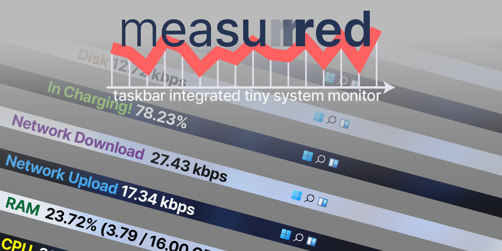

## Features

- Monitor the System
  - [x] CPU Usage
  - [x] Network Up/Down
  - [x] RAM Usage

- Monitor these stuffs:
  - GPU usage
  - Power usage trend
  - Batteries remaining
  - Core temperature
  - Weather
  - Disk usage
  - Fan speed

### Features I Want to Implement

- Move center of taskbar a little
- Alter clock
- Remove network integrated sound icon or replace that with EarTrumpet's one
- Applying WinUI?
  - Especially Windows 11 Mica material

## Caveats

- Only aims to support Windows 11.
  - Especially target my local environment. Other environment wouldn't be tested.
